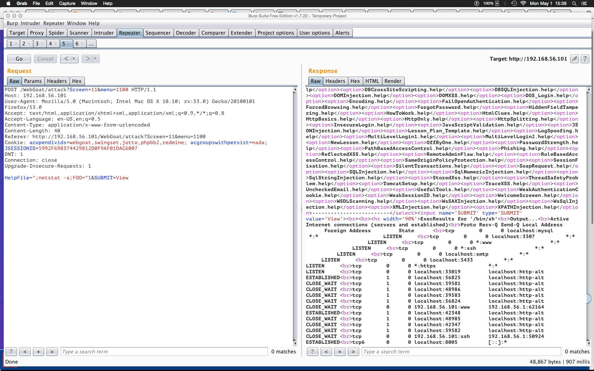
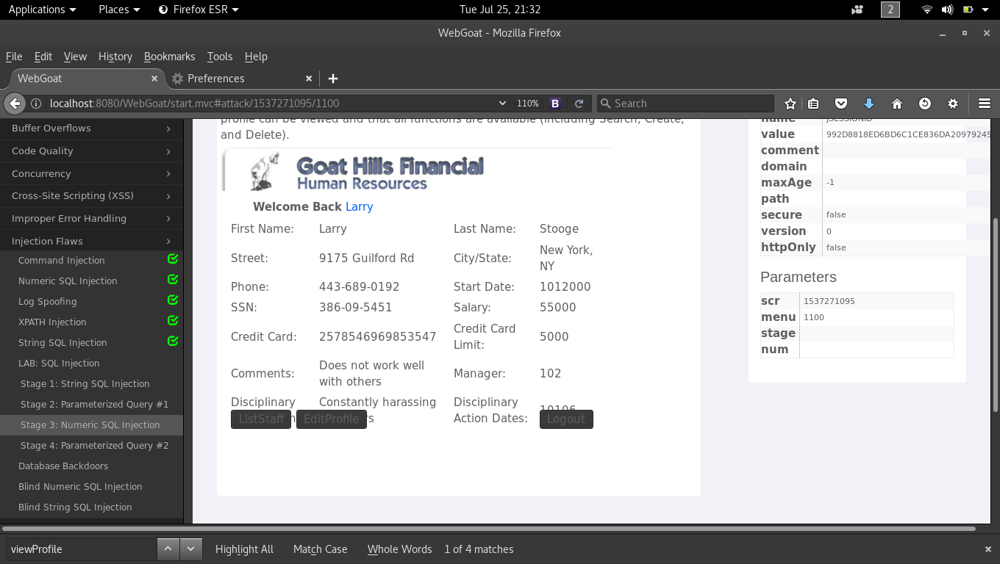
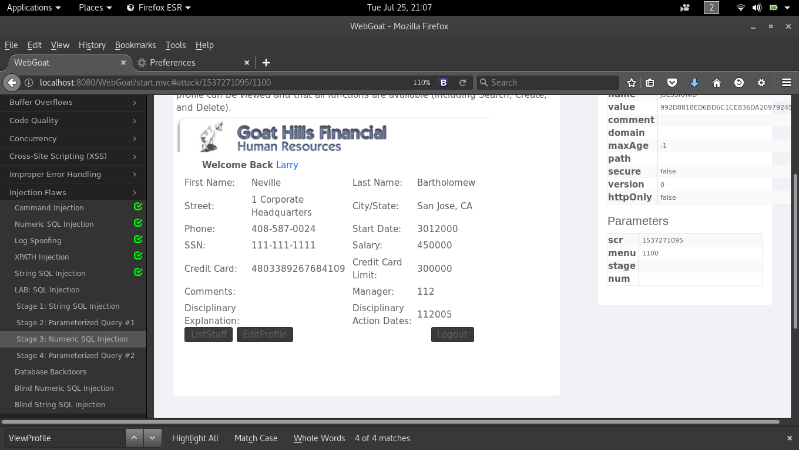
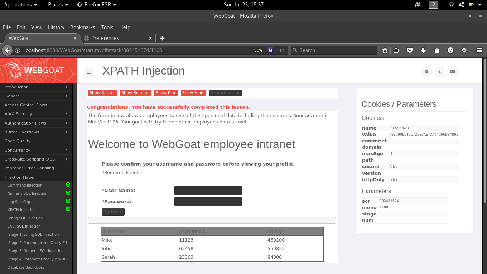

# Web Hacking 101 - SQL Injections.

###### [Lab_SQL_Injection-Stage1-String-Injection.md](Lab_SQL_Injection-Stage1-String-Injection.md)
###### [Lab_SQL_Injection-Stage3-Numeric-SQL-Injection.md](Lab_SQL_Injection-Stage3-Numeric-SQL-Injection.md)

### Burp.

##### [burp-webgoat-command-injection.tiff](burp-webgoat-command-injection.tiff)

## Xpath.

##### [xpath-injection-notes.md](xpath-injection-notes.md)

##### [log-spoofing-notes.md](log-spoofing-notes.md)
##### [running-webgoat-on-osx.md](running-webgoat-on-osx.md)
##### [string-sql-injection-notes.md](string-sql-injection-notes.md)
##### [webgoat-blind-numeric-sql-injection.md](webgoat-blind-numeric-sql-injection.md)
##### [webgoat-command-injection-notes.md](webgoat-command-injection-notes.md)
##### [webgoat-database-backdoors.md](webgoat-database-backdoors.md)

